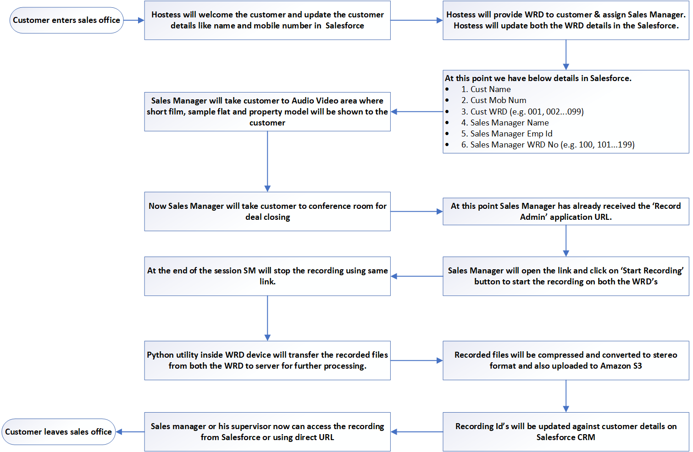

# TODO
- Add three excel from mail
- Add one 3d printing image in readme and all other files
- Remove Estimation & Battery Testing.txt and WRD SD Card Setps.md
- Add index

# Wearable-Recording-Device (WRD) <a id ="1"></a>
Wearable Recording Device (WRD) is ID card with embedded electronics for recording the conversation between sales executive and customer. It has upto 10 hours of battery life can record CD quality audio.


**For more images and videos please refer [Photos Album](https://photos.app.goo.gl/RuVcYvWjzzzGMZDB6)**

# Inspiration <a id ="2"></a>
One of India’s leading real-estate developer came to us with this requirement. Before coming to us they had tried all the obvious options like using top end smart phone and good quality microphone to record the conversations. But during their testing they were not happy with overall audio quality and they were also not able to make user friendly process flow. So the answer was to create an dedicated device for this use case only.

I had experience using Raspberry pi and other microcontrollers. Actually I had built complete home automation solution and got selected for Microsoft Bizspark program for that effort.  Since it was just POC I had decided to take it as challenge. It was really enjoying experience, to do hardware and software and make working product at end of it. Its one of the best experience in my career so far.
 
# Why We Choose Raspberry Pi? <a id ="3"></a>
Its even possible to do it using low power microcontroller, but since I had good working experience with Raspberry pi and it also provided more flexibility in term of hardware/API choice. Final product only used 20 to 30 % CPU while recording and around 60 % CPU while file transfer. So in terms of processing power we had lots of scope to do ML processing with same hardware. In phase II we had planned to do Realtime audio transcription and semantic analysis using NLP models.

# Architecture <a id ="4"></a>


# Items Used <a id ="5"></a>
- Raspberry Pi Zero W 
- MEMS Microphone
- PowerBost 1000 w/ 5V USB and Rechargeable Lipo Boost @ 1A
- MCP3008 - 8-Channel 10-Bit ADC With SPI Interface
- Mini Push Button Switch 
- RGB LED
- Samsung EVO Plus Grade 1, Class 10 32GB MicroSDHC 95 MB/S Memory Card
- Silicone Cover Stranded-Core Wire - 30AWG in Red, Blue, Black, Yellow, Green, White
- 5V, 1A Power Supply with USB Micro-B cable
- LiPo - Battery Model: 575577 (DNK Power), Thickness: 5.7, W: 55, L: 77, Min V: 3.7, Max V: 4.2, Capacity: 4400mAh

# Record Admin <a id ="6"></a>
Its a web page with sales person and customer WRD details with recording controls. Based on the mapping in Salesforce final url will get generated and sent to sales persons phone using SMS.


# Process Flow <a id ="7"></a>


# Design Details <a id ="8"></a>
* WRD dimensions: 88x127x8mm. Same as medium size ID card. Since electronic component and battery max thickness is 5mm, overall thickness can be reduced to 7mm!!
* WRD consists of microcomputer, MEMS Microphone, power management circuit and LIPO battery.
* Each WRD will record mono, high quality audio (channels=1, rate=44100, frames_per_buffer=1024) in wav fomrat.
* Using 'Recording Admin' user can start and stop the recording
* 'Record Admin' (RA) in node.js application running on web server. It will communicate with the WRD on port 8080 to start/stop the recordings. 
* At the end of recording, each WRD will copy the recorded files to server. On Server wav files will be converted to mp3(alomost 10 fold size reduction). 
* Mono file from customer and sales manager will be mergered together to create stereo combined mp3 file. Each mono and combined stereo file will be uploaed to Amazon S3.  
* For easy access recording ID of each recording will also be update on Saleforce CRM against the customer and sales manager.
* Speachh Analytics, not implemented as part of POC but can be done realtime on WRD or as batch process on server.
* SMS Gateway, used to send SMS to sales person and customer on recording start and end.

# Features <a id ="9"></a>
* Over the table conversation recording.
* Recording while walking/in lift, on sites where network/WiFi is not available.
* Recorded conversations can be used for speech analytics.
* No file size of recording time limit.
* Automatic linking of recorded conversation to Salesforce object.
* Automatic backup of recorded files on AWS S3 bucket.
* CD quality recording.
* Mono/Stereo files.
* Wav/mp3 files.

# 3D Printing <a id ="10"></a>
For design files please refer 3D Printing folder.

# Battery Calculations, Estimation, Testing <a id ="11"></a>
* Idle WRD will draw 130mA @ 5V
* WRD while recording will draw 150mA @5V
* WRD while transfering the files will draw 300mA @5V
* Lets assume WRD is drawing 200 mA @ 5V. => 1000mW @5V
* We are using boost converter for converting 3.7V to 5V, and with (assumed) efficient of 80%
* So 1000mW/3.7V = 270mA @3.7V, but we need to increase it by 20% as we are loosing 20% in boost conversion. 
* So total current requirements is 270mA + 20% of it =  324mA @3.7V, in addition the UPS itself is consuming about 10-15mA, so our total current requirements on 3.7 V Battery is 339mA.

## Estimation <a id ="12"></a>
* With 2000mAh LiPo battery, WRD should record for 2000mAh/339mA = 5.89 hours
* With 3000mAh LiPo battery, WRD should record for 3000mAh/339mA = 8.84 hours
* With 3500mAh LiPo battery, WRD should record for 3500mAh/339mA = 10.32 hours
* With 4000mAh LiPo battery, WRD should record for 4000mAh/339mA = 11.79 hours
* With 5000mAh LiPo battery, WRD should record for 5000mA/339mA = 14.74 hours
* With 5600mAh LiPo battery, WRD should record for 5600mAh/339mA = 16.51 hours

## DNK Battery Testing <a id ="13"></a>
* Capacity: 4400 mAh
* Consuption: 110A
* No Of Hours: 7.15 hours (3.75 cutoff voltage)
* No Of Hours: 12 hours (3.4 cutoff voltage)

## Adafruit PK Cell Battery Testing <a id ="14"></a>
* Capacity: 2500 mAh
* Consuption: 110A
* No Of Hours: 4.30 hours (3.75 cutoff voltage)

# Source Code & User Guide <a id ="15"></a>
For source code please refer [src folder](src). If you are interested in implementing this solution, please follow below steps. Alos make sure to refer the product page of each of these components used in this project. There must be some changes that may affect your workflow.
* [Raspbian Setup] (#16)
* [Development Setup] (#17)
* [USB Mic configuration] (#18)
* [I2S Mic configuration] (#19)
* [Using pyaudio] (#20)
* [Uisng Bottle: Python Web Framework] (#21)
* [Pi Stats] (#22)
* [Samba File Server] (#23)
* [Python GET/POST Rest Requests] (#24)
* [Python Script "record.py"] (#25)

## Raspbian Setup <a id ="16"></a>
- Installed Raspbian Strech Lite on 32 Gb SD Card. Followed Raspberry pi installation guide.       https://www.raspberrypi.org/documentation/installation/installing-images/README.md
- Configure SD Card for wifi connection and enabled SSH. https://core-electronics.com.au/tutorials/raspberry-pi-zerow-headless-wifi-setup.html
wpa_supplicant.conf file content:
```
ctrl_interface=DIR=/var/run/wpa_supplicant GROUP=netdev
    update_config=1
    country=IN

    network={
            ssid="Nandanvan"
            psk="********"
            key_mgmt=WPA-PSK
    }

    network={
            ssid="OnePlus3"
            psk="*******"
            key_mgmt=WPA-PSK
    }
```
- Note: After login, Can use command "sudo nano /etc/wpa_supplicant/wpa_supplicant.conf" to edit/update ssid’s
- Using command 'sudo raspi-config' update country, localisation, hostname, password, expand fileset.
- Interfacing Options" / "Pi Serial". It is then necessary to answer as follows:
       ```
   		 "Would you like a login shell to be accessible over serial?" - No
   		 "Would you like the serial port hardware to be enabled?" - Yes
       ```
- Reboot pi

## Development Setup <a id ="17"></a>
- Run below command
```
  sudo apt-get update
  sudo apt-get upgrade
  sudo apt-get install python-dev
  sudo apt-get install python-setuptools
  sudo easy_install rpi.gpio
```

## USB Mic configuration <a id ="18"></a>
- If using USB microphone then follow Adafruit doc for USB Mic configuration. https://learn.adafruit.com/usb-audio-cards-with-a-raspberry-pi/figure-out-your-chipset

## I2S MEMS Mic configuration <a id ="19"></a>
- If using I2S MEMS microphone then follow Adafruit doc for Adafruit I2S Mic configuration. https://learn.adafruit.com/adafruit-i2s-mems-microphone-breakout?view=all

## Using pyaudio <a id ="20"></a>
- Install pyaudio using below commands
```
 sudo apt-get install git
 sudo git clone http://people.csail.mit.edu/hubert/git/pyaudio.git
 sudo apt-get install libportaudio0 libportaudio2 libportaudiocpp0 portaudio19-dev
 cd pyaudio
 sudo python setup.py install
```
- Now you can record audio using python program
- For USB mic use below details in python script
```
 channels=1, rate=44100, frames_per_buffer=1024
 "format=pyaudio.paInt16" in start_recording() funaction  and "pyaudio.paInt16" in _prepare_file() function
```
- For Adafruit I2S mic use below details in python script
```
 channels=1, rate=48000, frames_per_buffer=2400
 "format=pyaudio.paInt32" in start_recording() function and "pyaudio.paInt32" in _prepare_file() function
```
## Uisng Bottle: Python Web Framework <a id ="21"></a>
- Use 'sudo apt-get install python-bottle' command to install 
- In python script let server listen to all interfaces at once (e.g. run(host='0.0.0.0'))
  ref. https://electronut.in/talking-to-a-raspberry-pi-from-your-phone-using-bottle-python/
  
## Pi Stats <a id ="22"></a>
- Install psutil using below commands
```
sudo apt-get install python-pip python-dev
sudo pip install psutil
```
- Ref. https://www.raspberrypi.org/forums/viewtopic.php?f=32&t=22180

## Samba File Server <a id ="23"></a>
- In order to share the files from RPI we willbe using Samba file server
- Install Samba using below commands
```
sudo apt-get install samba samba-common-bin
sudo mkdir -m 1777 /home/pi/RecordedFiles
```
- Edit Samba’s config files to make the file share visible to the Windows PCs on the network.
```
sudo nano /etc/samba/smb.conf
add below lines at the end of file
   
  [RecordedFiles]
  Comment = Pi shared folder
  Path = /home/pi/RecordedFiles
  Browseable = yes
  Writeable = Yes
  only guest = no
  create mask = 0777
  directory mask = 0777
  Public = yes
  Guest ok = yes
```
- Set new sambs password using below command. This will add the user pi to the list of Samba users and pi
```
 sudo smbpasswd -a pi
 #new password: samba
```
- Now restart the Samba. sudo /etc/init.d/samba restart
- Now try to access RPI file from PC. Shared folder path will be @"\\<ip address>\RecordedFiles\filename.wav"
- Samba Server Installation ref.  https://www.raspberrypi.org/magpi/samba-file-server/
    
## Python GET/POST Rest Requests <a id ="24"></a>
- Install 'requests' using command. sudo pip install requests
 
## Python Script "record.py" <a id ="25"></a>
- Please refer 'src' folder for source code.
- To run 'recod.py' as service. ref. http://www.diegoacuna.me/how-to-run-a-script-as-a-service-in-raspberry-pi-raspbian-jessie/
- Define the service to run this script:
```
cd /lib/systemd/system/
sudo nano record.service
```
- The service definition must be on the /lib/systemd/system folder. Our service is going to be called "record.service":
```
 [Unit]
 Description=Recording Service
 After=multi-user.target
 
 [Service]
 Type=simple
 ExecStart=/usr/bin/python /home/pi/record.py
 Restart=on-abort
 
 [Install]
 WantedBy=multi-user.target
```
- Now that we have our service we need to activate it
```
 sudo chmod 644 /lib/systemd/system/record.service
 chmod +x /home/pi/record.py
 sudo systemctl daemon-reload
 sudo systemctl enable record.service
 sudo systemctl start record.service
```
- For every change that we do on the /lib/systemd/system folder we need to execute a 'daemon-reload'. If we want to check the status of our service, you can execute: 'sudo systemctl status record.service'
- In general:
```
 # Check status
 sudo systemctl status record.service
 
 # Start service
 sudo systemctl start record.service
 
 # Stop service
 sudo systemctl stop record.service
 
 # Check service's log
 sudo journalctl -f -u record.service
```
