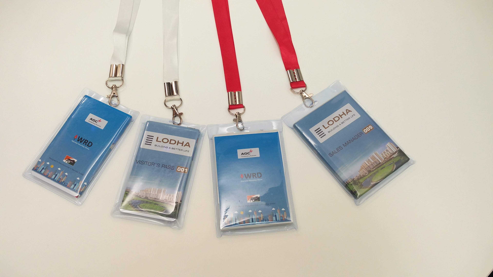
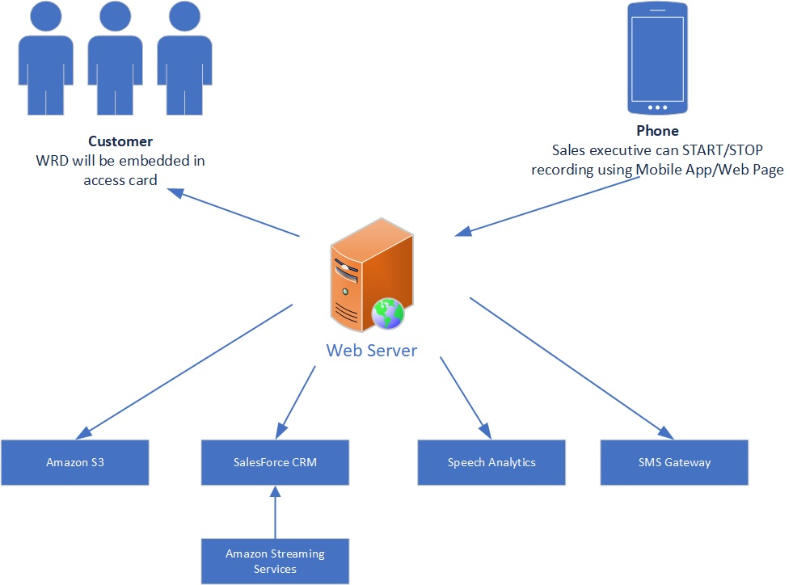
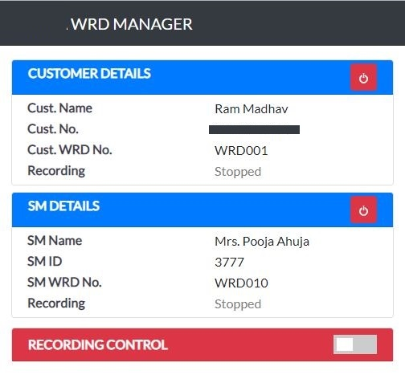

# Wearable-Recording-Device (WRD)
Smart wearable recording device with 10 hours of battery life to record CD quality audio.

For more images and videos please refer [Photos Album](https://photos.app.goo.gl/RuVcYvWjzzzGMZDB6)

# Architecture

# Design Details
1. WRD dimensions: 88x127x8mm. Same as medium size ID card. Since electronic component and battery max thickness is 5mm, overall thickness can be reduced to 7mm!!
2. WRD consists of microcomputer, MEMS Microphone, power management circuit and LIPO battery.
3. Each WRD will record mono high quality audio (channels=1, rate=44100, frames_per_buffer=1024) in wav fomrat.
4. Using 'Recording Admin' user can start and stop the recording
5. 'Record Admin' (RA) in node.js application running on web server. It will communicate with the WRD on port 8080 to start/stop the recordings. And at the end of recording copy the recorded files to server wav file will be converted to mp3(alomost 10 fold size reduction). Mono file from customer and sales manager will be mergered together to create stereo combined mp3 file. Each mono and combined stereo file will be uploaed to Amazon S3.  RA will also update the Saleforce CRM with recording id against the customer and sales manager.
6. Saleforce CRM will be integrated with Amazon Streaming services to listen to the recorded files(available on S3)
7. Speachh Analytics: As per customer requirements rules can be set for analytics using mono as wel as stereo files.
8. SMS Gateway: On recording start and end, SMS will be sent to the customer 
9. For estimation & battery testing Ref 'Estimation & Battery Testing.txt'

# Record Admin

# List of Items Used

- Raspberry Pi Zero W 
- MEMS Microphone
- PowerBost 1000 w/ 5V USB and Rechargeable Lipo Boost @ 1A
- MCP3008 - 8-Channel 10-Bit ADC With SPI Interface
- Mini Push Button Switch 
- RGB LED (3)
- Samsung EVO Plus Grade 1, Class 10 32GB MicroSDHC 95 MB/S Memory Card
- Silicone Cover Stranded-Core Wire - 30AWG in Red, Blue, Black, Yellow, Green, White
- 5V, 1A Power Supply with USB Micro-B cable
- LiPo - Battery Model: 575577 (DNK Power), Thickness: 5.7, W: 55, L: 77, Min V: 3.7, Max V: 4.2, Capacity: 4400mAh

### Source Code
* For source code please refer [src folder](src)
* If you are interested in implementing this solution, please refer [WRD SD Card Setps](https://github.com/satishgunjal/Wearable-Recording-Device/blob/master/WRD%20SD%20Card%20Setps.md)

