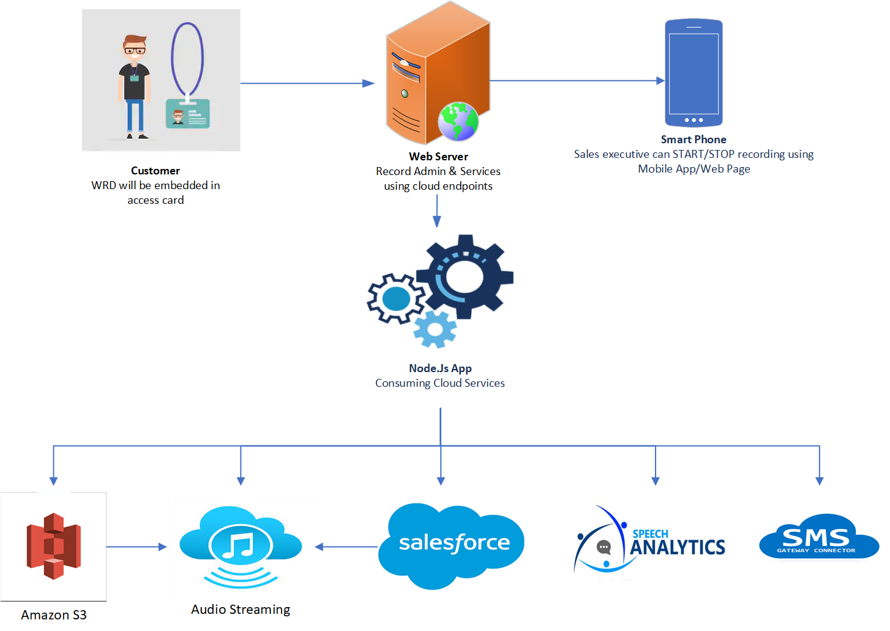

# Wearable-Recording-Device (WRD)
Wearable Recording Device (WRD) is ID card with embedded electronics for recording the conversation between sales executive and customer. It has upto 10 hours of battery life can record CD quality audio.

**For more images and videos please refer [Photos Album](https://photos.app.goo.gl/RuVcYvWjzzzGMZDB6)**

# Inspiration
One of India’s leading real-estate developer came to us with this requirement. Before coming to us they had tried all the obvious options like using top end smart phone and good quality microphone to record the conversations. But during their testing they were not happy with overall audio quality and they were also not able to make user friendly process flow. So the answer was to create an dedicated device for this use case only.

I had experience using Raspberry pi and other microcontrollers. Actually I had built complete home automation solution and got selected for Microsoft Bizspark program for that effort.  Since it was just POC I had decided to take it as challenge. It was really enjoying experience, to do hardware and software and make working product at end of it. Its one of the best experience in my career so far.

# Why We Choose Raspberry Pi?
Its even possible to do it using low power microcontroller, but since I had good working experience with Raspberry pi and it also provided more flexibility in term of hardware/API choice. Final product only used 20 to 30 % CPU while recording and around 60 % CPU while file transfer. So in terms of processing power we had lots of scope to do ML processing with same hardware. In phase II we had planned to do Realtime audio transcription and semantic analysis using NLP models.

# Architecture

# Items Used
- Raspberry Pi Zero W 
- MEMS Microphone
- PowerBost 1000 w/ 5V USB and Rechargeable Lipo Boost @ 1A
- MCP3008 - 8-Channel 10-Bit ADC With SPI Interface
- Mini Push Button Switch 
- RGB LED
- Samsung EVO Plus Grade 1, Class 10 32GB MicroSDHC 95 MB/S Memory Card
- Silicone Cover Stranded-Core Wire - 30AWG in Red, Blue, Black, Yellow, Green, White
- 5V, 1A Power Supply with USB Micro-B cable
- LiPo - Battery Model: 575577 (DNK Power), Thickness: 5.7, W: 55, L: 77, Min V: 3.7, Max V: 4.2, Capacity: 4400mAh

# Record Admin
Its a web page with sales person and customer WRD details with recording controls. Based on the mapping in Salesforce final url will get generated and sent to sales persons phone using SMS.

# Process Flow

# Design Details
* WRD dimensions: 88x127x8mm. Same as medium size ID card. Since electronic component and battery max thickness is 5mm, overall thickness can be reduced to 7mm!!
* WRD consists of microcomputer, MEMS Microphone, power management circuit and LIPO battery.
* Each WRD will record mono, high quality audio (channels=1, rate=44100, frames_per_buffer=1024) in wav fomrat.
* Using 'Recording Admin' user can start and stop the recording
* 'Record Admin' (RA) in node.js application running on web server. It will communicate with the WRD on port 8080 to start/stop the recordings. 
* At the end of recording, each WRD will copy the recorded files to server. On Server wav files will be converted to mp3(alomost 10 fold size reduction). 
* Mono file from customer and sales manager will be mergered together to create stereo combined mp3 file. Each mono and combined stereo file will be uploaed to Amazon S3.  
* For easy access recording ID of each recording will also be update on Saleforce CRM against the customer and sales manager.
* Speachh Analytics, not implemented as part of POC but can be done realtime on WRD or as batch process on server.
* SMS Gateway, used to send SMS to sales person and customer on recording start and end.

# Features
* Over the table conversation recording.
* Recording while walking/in lift, on sites where network/WiFi is not available.
* Recorded conversations can be used for speech analytics.
* No file size of recording time limit.
* Automatic linking of recorded conversation to Salesforce object.
* Automatic backup of recorded files on AWS S3 bucket.
* CD quality recording.
* Mono/Stereo files.
* Wav/mp3 files.

# 3D Printing
For design files please refer 3D Printing folder.

# Battery Calculations, Estimation, Testing
* Idle WRD will draw 130mA @ 5V
* WRD while recording will draw 150mA @5V
* WRD while transfering the files will draw 300mA @5V
* Lets assume WRD is drawing 200 mA @ 5V. => 1000mW @5V
* We are using boost converter for converting 3.7V to 5V, and with (assumed) efficient of 80%
* So 1000mW/3.7V = 270mA @3.7V, but we need to increase it by 20% as we are loosing 20% in boost conversion. 
* So total current requirements is 270mA + 20% of it =  324mA @3.7V, in addition the UPS itself is consuming about 10-15mA, so our total current requirements on 3.7 V Battery is 339mA.

## Estimation
* With 2000mAh LiPo battery, WRD should record for 2000mAh/339mA = 5.89 hours
* With 3000mAh LiPo battery, WRD should record for 3000mAh/339mA = 8.84 hours
* With 3500mAh LiPo battery, WRD should record for 3500mAh/339mA = 10.32 hours
* With 4000mAh LiPo battery, WRD should record for 4000mAh/339mA = 11.79 hours
* With 5000mAh LiPo battery, WRD should record for 5000mA/339mA = 14.74 hours
* With 5600mAh LiPo battery, WRD should record for 5600mAh/339mA = 16.51 hours

## DNK Battery Testing
* Capacity: 4400 mAh
* Consuption: 110A
* No Of Hours: 7.15 hours (3.75 cutoff voltage)
* No Of Hours: 12 hours (3.4 cutoff voltage)

## Adafruit PK Cell Battery Testing
* Capacity: 2500 mAh
* Consuption: 110A
* No Of Hours: 4.30 hours (3.75 cutoff voltage)

# Source Code & User Guide
* For source code please refer [src folder](src)
* If you are interested in implementing this solution, please refer [WRD SD Card Setps](https://github.com/satishgunjal/Wearable-Recording-Device/blob/master/WRD%20SD%20Card%20Setps.md)

